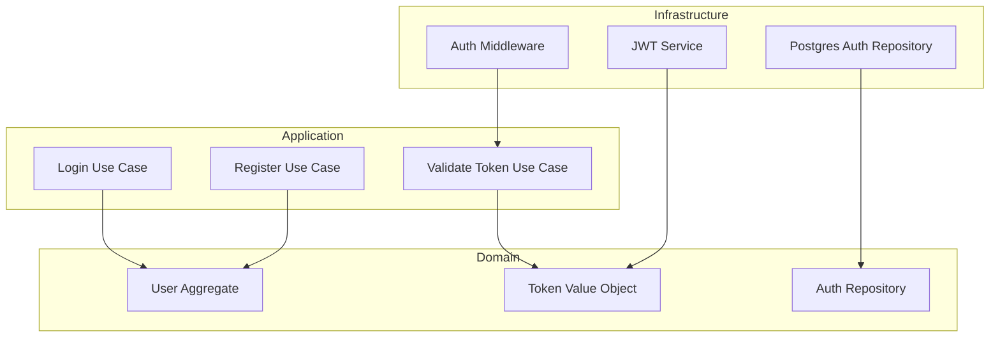

# ADR 013: Autenticación JWT en API

## Status
Propuesto

## Context
El sistema necesita implementar autenticación para proteger las rutas de la API del backoffice. Se requiere un sistema de autenticación que:
- Sea stateless para facilitar la escalabilidad
- Proporcione seguridad adecuada para una API REST
- Se integre bien con la arquitectura hexagonal existente
- Soporte autenticación en el frontend (Vue) y backend (Next.js)

## Decision
Implementaremos autenticación basada en JWT (JSON Web Tokens) con las siguientes características:

### 1. Nuevo Contexto Acotado: Auth

### 2. Estructura de Tokens JWT
- **Payload**:
  - userId: Identificador único del usuario
  - email: Email del usuario
  - exp: Tiempo de expiración
  - iat: Tiempo de emisión

### 3. Endpoints de Autenticación
- POST /api/backoffice/auth/login
- POST /api/backoffice/auth/register
- POST /api/backoffice/auth/refresh-token

### 4. Middleware de Autenticación
- Validación de tokens en cada request protegido
- Inyección de información del usuario en el contexto
- Manejo de errores de autenticación

## Consequences
### Positivas
1. Sistema de autenticación stateless y escalable
2. Separación clara de responsabilidades
3. Reutilización del token entre frontend y backend
4. Sistema simple y fácil de mantener

### Negativas
1. Necesidad de gestionar la renovación de tokens
2. Overhead en cada request para validar tokens
3. Mayor complejidad en el manejo de sesiones

## Implementation Notes
1. **Domain**:
   - User: Aggregate root para usuarios
   - Token: Value Object para validación
   - AuthRepository: Interface para persistencia

2. **Application**:
   - Login: Autenticación de usuarios
   - Register: Registro de nuevos usuarios
   - ValidateToken: Validación de tokens JWT

3. **Infrastructure**:
   - JWTService: Generación y validación de tokens
   - PostgresAuthRepository: Implementación de persistencia
   - AuthMiddleware: Middleware de autenticación

4. **Testing**:
   - Unit tests para lógica de dominio
   - Integration tests para persistencia
   - E2E tests para flujos de autenticación
