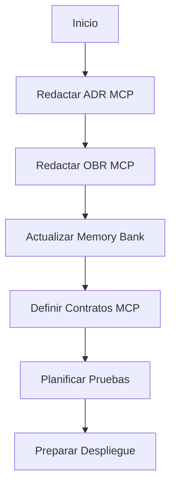

# ADR-014: Integración de Servidor MCP para Agente IA

## Contexto y Motivación

El sistema de blog requiere automatización avanzada para la gestión de artículos, incluyendo publicación, edición, moderación automática y control de versiones. La integración de un servidor MCP permitirá que un agente IA realice estas operaciones de forma segura, eficiente y auditable, mejorando la productividad y calidad del contenido.

## Problema

Actualmente, la gestión de artículos depende de acciones manuales y endpoints REST. Esto limita la automatización, la moderación proactiva y la trazabilidad de cambios. Se necesita un canal dedicado para agentes IA que permita operaciones avanzadas y control granular.

## Objetivos

- Permitir que el agente IA gestione artículos (CRUD, moderación, versionado) vía MCP.
- Garantizar autenticación y autorización robusta para agentes.
- Auditar todas las acciones automáticas.
- Mantener la arquitectura hexagonal y DDD.
- Facilitar extensibilidad para nuevos comandos y eventos.

## Alternativas Consideradas

- **WebSocket**: Comunicación bidireccional en tiempo real, útil para agentes interactivos. Descartado por complejidad de estado y menor trazabilidad.
- **REST API**: Integración tradicional, menos eficiente para operaciones reactivas y automatizadas.
- **gRPC**: Alto rendimiento, pero mayor complejidad y menor soporte nativo en Next.js.
- **MCP**: Protocolo flexible, diseñado para agentes y automatización, con soporte para comandos, eventos y autenticación granular.

## Decisión

Se elige MCP como canal principal para la integración del agente IA, por su flexibilidad, seguridad y capacidad de auditar acciones. MCP se implementará como un adaptador en la infraestructura, conectado al dominio de artículos y libros.

## Implementación Técnica

### 1. Adaptador MCP

- Crear un módulo `src/contexts/shared/infrastructure/mcp/MCPAdapter.ts` que exponga una interfaz para recibir comandos y enviar eventos.
- El adaptador MCP se registrará como endpoint dedicado (`/api/mcp`), aceptando peticiones del agente IA.

### 2. Contratos MCP

- Definir comandos MCP: `PublishArticle`, `EditArticle`, `DeleteArticle`, `ModerateArticle`, `VersionArticle`.
- Cada comando tendrá un DTO validado y autenticado.
- Los eventos MCP (`ArticlePublished`, `ModerationRejected`, `VersionReverted`) se enviarán como respuesta o notificación.

### 3. Autenticación y Autorización

- Implementar autenticación JWT específica para agentes IA.
- Middleware en el endpoint MCP para validar token, roles y permisos.
- Control granular de acceso a operaciones sensibles (moderación, borrado, versionado).

### 4. Integración con el Dominio

- Los comandos MCP invocan casos de uso existentes (`CreateArticle`, `UpdateArticle`, `DeleteArticle`, etc.).
- Añadir lógica de moderación automática y versionado en los agregados de artículo.
- Registrar todas las acciones automáticas en la base de datos para auditoría.

### 5. Logging y Auditoría

- Registrar cada comando recibido y evento generado en una tabla de auditoría.
- Incluir información de agente, timestamp, operación y resultado.

### 6. Testing y Validación

- Mock de agente IA para pruebas de integración.
- Tests unitarios para el adaptador MCP y middleware.
- Pruebas de seguridad (autenticación, autorización, validación de datos).
- Pruebas de edge-cases (fallos de conexión, conflictos de versiones, moderación rechazada).

### 7. Monitorización y Alertas

- Integrar logs MCP con el sistema de monitorización existente.
- Alertas automáticas ante errores críticos o acciones sospechosas.

## Impacto Arquitectónico

- Nuevo adaptador MCP en la capa de infraestructura.
- Modificación de casos de uso y agregados para soportar comandos MCP.
- Middleware de autenticación y autorización para agentes.
- Logging y auditoría de acciones automáticas.
- Actualización de tests y documentación.
- Posible refactorización de endpoints para soportar operaciones MCP.

## Requisitos Técnicos

- Implementar servidor MCP compatible con Next.js y PostgreSQL.
- Definir contratos y comandos MCP (publicar, editar, moderar, versionar).
- Autenticación robusta (JWT o similar).
- Validación y control de acceso granular.
- Monitorización y alertas para acciones automáticas.
- Pruebas de integración y seguridad para el canal MCP.

## Riesgos y Consideraciones

- Complejidad adicional en la infraestructura.
- Necesidad de pruebas exhaustivas para evitar acciones no deseadas del agente.
- Gestión de concurrencia y conflictos de versiones.
- Seguridad reforzada para evitar accesos indebidos.

## Coste Estimado

- **Documentación**: 2-3h para ADR, OBR y memory bank.
- **Implementación técnica**: 8-16h (dependiendo de la complejidad de la integración, pruebas y despliegue).
- **Testing y validación**: 4-6h (mock de agente, pruebas de integración y seguridad).

## Diagrama de Flujo

