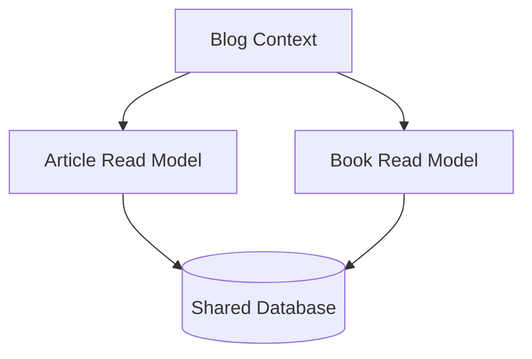

# ADR 015: Contexto Blog y Read Model

## Estado
Propuesto

## Contexto
Necesitamos exponer la información de artículos y libros para el blog público, separado del backoffice donde se gestiona el contenido.

## Decisión

### 1. Nuevo Contexto Blog
Crearemos un nuevo contexto `blog` separado del `backoffice` que actuará como read model:



### 2. Estructura de Carpetas

#### Contexto Blog
```
src/contexts/blog/
├── article/
│   ├── application/
│   │   ├── GetArticleBySlug.ts
│   │   └── ListArticles.ts
│   ├── domain/
│   │   ├── BlogArticle.ts       # Incluye BlogBook embedido
│   │   ├── BlogBook.ts          # Value Object para libros
│   │   ├── BlogArticleRepository.ts
│   │   └── BlogArticleNotFound.ts
│   └── infrastructure/
│       └── persistence/
│           └── PostgresBlogArticleRepository.ts
└── shared/
    ├── domain/
    │   └── DomainError.ts
    └── infrastructure/
        └── security/
            └── CorsMiddleware.ts
```

#### Controllers (Next.js API Routes)
```
src/app/api/
├── blog/
│   └── articles/
│       ├── route.ts              # GET /api/blog/articles
│       └── by-slug/
│           └── [slug]/
│               └── route.ts      # GET /api/blog/articles/by-slug/[slug]
```

### 3. Modelos de Dominio

#### BlogArticle
```typescript
export class BlogArticle {
  constructor(
    readonly id: string,
    readonly title: string,
    readonly excerpt: string,
    readonly content: string,
    readonly books: BlogBook[],  // Libros embedidos directamente
    readonly relatedLinks: Array<{ text: string; url: string }>,
    readonly slug: string,
    readonly createdAt: Date,
    readonly updatedAt: Date
  ) {}
}
```

#### BlogBook (Value Object)
```typescript
export class BlogBook {
  constructor(
    readonly id: string,
    readonly title: string,
    readonly author: string,
    readonly isbn: string,
    readonly description: string,
    readonly purchaseLink: string | null,
    readonly createdAt: Date,
    readonly updatedAt: Date
  ) {}
}
```

### 4. Casos de Uso

#### ListArticles
```typescript
interface BlogArticleRepository {
  findAll(): Promise<BlogArticle[]>;  // Incluye los libros relacionados
}

export class ListArticles {
  constructor(private repository: BlogArticleRepository) {}
  
  async execute(): Promise<BlogArticle[]> {
    return this.repository.findAll();
  }
}
```

#### GetArticleBySlug
```typescript
interface BlogArticleRepository {
  findBySlug(slug: string): Promise<BlogArticle | null>;
}

export class GetArticleBySlug {
  constructor(private repository: BlogArticleRepository) {}
  
  async execute(slug: string): Promise<BlogArticle> {
    const article = await this.repository.findBySlug(slug);
    if (!article) throw new BlogArticleNotFound();
    return article;
  }
}
```

### 5. Endpoints
```
GET /api/blog/articles
- Lista todos los artículos con sus libros relacionados
- No requiere paginación (pocos artículos)
- Respuesta: 200 OK (BlogArticle[])

GET /api/blog/articles/by-slug/{slug}
- Obtiene un artículo específico por su slug
- Incluye información completa de libros relacionados
- Respuesta: 200 OK (BlogArticle) | 404 Not Found
```

### 6. Detalles de Implementación

#### API Routes (Next.js)
- Ubicadas en `src/app/api/blog/`
- Implementan la capa HTTP utilizando Next.js route handlers
- Aplican middleware CORS
- La respuesta JSON es directamente el modelo BlogArticle

#### Persistence
- `PostgresBlogArticleRepository`: Implementa consultas optimizadas para obtener artículos con sus libros en una sola query
- Reutiliza la conexión a base de datos existente
- Mapea los resultados directamente a BlogArticle con sus BlogBooks

#### Security
- `CorsMiddleware`: Implementado como middleware de Next.js
- Configurable para los dominios permitidos:
  * localhost
  * https://diegopertusa.netlify.app/
  * https://diegopertusa.com/

## Consecuencias

### Positivas
- Modelo de dominio simple y directo
- No necesita DTOs adicionales
- Consultas optimizadas al incluir libros directamente
- Clara separación de responsabilidades
- Fácil de testear

### Negativas
- Compartir base de datos crea acoplamiento implícito
- Posible impacto en rendimiento al cargar siempre los libros
- Necesidad de mantener consistencia en los modelos

## Notas de Implementación
1. Seguir TDD estrictamente:
   - Tests de dominio (BlogArticle, BlogBook)
   - Tests de aplicación (casos de uso)
   - Tests e2e (API routes)
2. Implementar primero los tests de integración para validar CORS
3. Optimizar queries para cargar artículos con libros eficientemente
