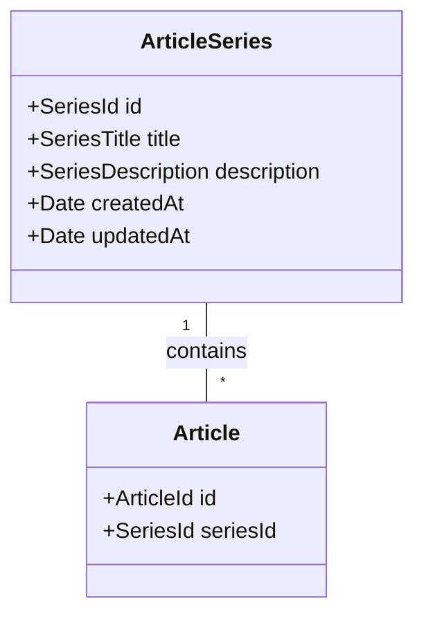

# Series de Artículos

Fecha: 2025-08-09

## Estado

Implemented

## Contexto

Necesitamos una forma de agrupar artículos relacionados que tratan sobre un mismo tema para mejorar la experiencia de usuario y la organización del contenido.

## Decisión

Implementaremos un sistema de "Series de Artículos" como un dominio independiente, separado del dominio de artículos, con las siguientes características:

1. Nuevo subdominio `series` dentro de los contextos blog y backoffice
2. Una serie es una colección de artículos relacionados
3. Un artículo puede pertenecer a una única serie (relación 1:N)
4. Las series tendrán:
   - ID único
   - Título
   - Descripción
   - Lista de artículos asociados
   - Fecha de creación/actualización

### Estructura de Directorios

```
src/contexts/
├── blog/
│   ├── article/     (dominio existente)
│   └── series/      (nuevo dominio)
└── backoffice/
    ├── article/     (dominio existente)
    └── series/      (nuevo dominio)
```

### Modelo de Dominio



### Separación de Responsabilidades

1. Dominio de Series:

   - Gestión del ciclo de vida de las series
   - Validación de reglas específicas de series
   - Eventos de dominio relacionados con series

2. Dominio de Artículos:
   - Mantiene su responsabilidad actual
   - Se añade referencia a SeriesId
   - Eventos de asignación/desasignación de series

### Endpoints

Blog:

- GET /api/blog/series - Lista todas las series
- GET /api/blog/series/{id}/articles - Obtiene los artículos de una serie

Backoffice:

- GET /api/backoffice/series - Lista series
- POST /api/backoffice/series - Crea serie
- PUT /api/backoffice/series/{id} - Actualiza serie
- DELETE /api/backoffice/series/{id} - Elimina serie y desvincula artículos

## Consecuencias

### Positivas

- Mejor organización del contenido
- Separación clara de responsabilidades
- Dominio de artículos más enfocado y cohesivo
- Facilita la evolución independiente de cada dominio
- Mejora SEO al establecer relaciones entre contenidos

### Negativas

- Necesidad de coordinar eventos entre dominios
- Mayor complejidad en la infraestructura
- Requiere mantener consistencia entre dominios
- Necesidad de migrar datos existentes si hay artículos que deberían estar en series

## Referencias

- User Story: Implementación de Series de Artículos
- Dominio actual de Artículos en src/contexts/blog/article/domain/
