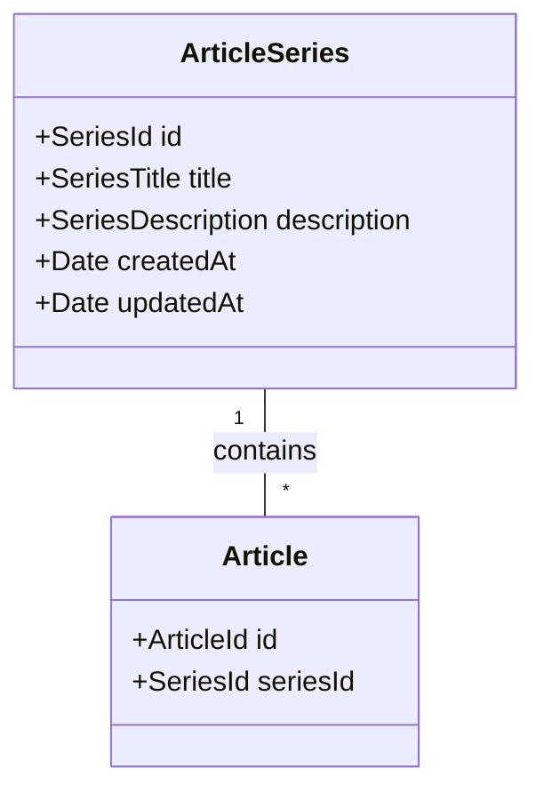

# Series de Artículos

Fecha: 2025-08-09

## Estado

Propuesto

## Contexto

Necesitamos una forma de agrupar artículos relacionados que tratan sobre un mismo tema para mejorar la experiencia de usuario y la organización del contenido.

## Decisión

Implementaremos un sistema de "Series de Artículos" con las siguientes características:

1. Una serie es una colección de artículos relacionados
2. Un artículo puede pertenecer a una única serie (relación 1:N)
3. Las series tendrán:
   - ID único
   - Título
   - Descripción
   - Lista de artículos asociados
   - Fecha de creación/actualización

### Modelo de Dominio

### Endpoints

Blog:

- GET /api/blog/series - Lista todas las series
- GET /api/blog/series/{id}/articles - Obtiene los artículos de una serie

Backoffice:

- GET /api/backoffice/series - Lista series
- POST /api/backoffice/series - Crea serie
- PUT /api/backoffice/series/{id} - Actualiza serie
- DELETE /api/backoffice/series/{id} - Elimina serie y desvincula artículos

## Consecuencias

### Positivas

- Mejor organización del contenido
- Facilita la navegación entre artículos relacionados
- Mejora SEO al establecer relaciones entre contenidos

### Negativas

- Añade complejidad al modelo de dominio
- Requiere mantener la consistencia al eliminar series
- Necesidad de migrar datos existentes si hay artículos que deberían estar en series

## Referencias

- User Story: Implementación de Series de Artículos
- Dominio actual de Artículos en src/contexts/blog/article/domain/
