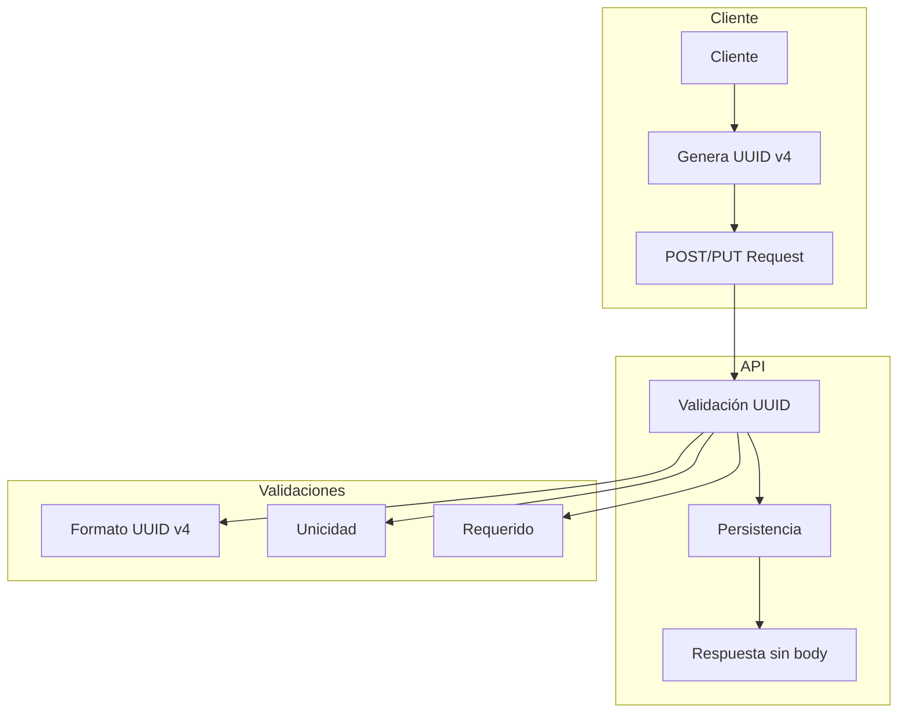

# Client-Side UUID Generation - Article Module Implementation Plan

## Objetivo
Implementar la generación de UUIDs en el lado del cliente para el módulo Article, siguiendo el patrón establecido en el módulo Book.

## Diagrama de Cambios


## Pasos de Implementación

### 1. Domain Layer
1. Actualizar Value Objects
   - Modificar `ArticleId` para validar formato UUID v4
   - Verificar implementación de `ArticleIdDuplicated` error
   - Verificar implementación de `ArticleNotFound` error

2. Actualizar Entidad Article
   - Verificar que el constructor acepta ID como parámetro
   - Actualizar validaciones si es necesario

### 2. Application Layer
1. Modificar Use Cases
   - Actualizar `CreateArticle` para no generar ID
   - Modificar `UpdateArticle` para validar ID existente
   - Implementar validación de unicidad en ambos casos
   - Asegurar que las respuestas no incluyen el cuerpo

### 3. Infrastructure Layer
1. Repository
   - Actualizar `PostgresArticleRepository`
   - Implementar check de duplicados
   - Asegurar que los métodos de creación y actualización no retornan el artículo

## Plan de Testing

### 1. Unit Tests
- Value Objects
  ```typescript
  describe('ArticleId', () => {
    test('should accept valid UUID v4')
    test('should reject invalid UUID format')
    test('should reject empty UUID')
  })
  ```

- Domain Entity
  ```typescript
  describe('Article', () => {
    test('should create with client provided UUID')
    test('should reject invalid UUID')
  })
  ```

### 2. Integration Tests
- Repository
  ```typescript
  describe('PostgresArticleRepository', () => {
    test('should store article with client UUID')
    test('should reject duplicate UUID')
    test('should update without returning article')
  })
  ```

### 3. E2E Tests
- API Endpoints
  ```typescript
  describe('POST /api/blog/articles', () => {
    test('should create with valid UUID')
    test('should return 201 without body')
    test('should reject invalid UUID format')
    test('should reject duplicate UUID')
    test('should reject missing UUID')
  })

  describe('PUT /api/blog/articles/:id', () => {
    test('should update and return 204')
    test('should reject invalid UUID')
  })
  ```

## Documentación a Actualizar

1. API Documentation
   - Actualizar formato de request/response
   - Añadir ejemplos de UUID v4
   - Documentar nuevos códigos de error
   - Actualizar ejemplos curl/postman

2. Swagger/OpenAPI
   - Actualizar schemas
   - Actualizar ejemplos
   - Documentar errores 409 para duplicados
   - Documentar errores 400 para UUIDs inválidos

## Criterios de Aceptación

1. La API debe:
   - Aceptar UUIDs proporcionados por el cliente
   - Validar el formato UUID v4
   - Rechazar UUIDs duplicados
   - No retornar cuerpo en las respuestas 201/204
   - Manejar errores con códigos HTTP apropiados

2. Los tests deben:
   - Cubrir todos los casos de uso
   - Verificar manejo de errores
   - Validar formatos de respuesta
   - Confirmar códigos HTTP correctos

## Rollback Plan

1. Sistema de feature flags para desactivar la validación de UUIDs del cliente
2. Mantener temporalmente la generación de IDs en servidor como fallback
3. Monitorear errores de validación UUID
4. Plan de reversión si se detectan problemas críticos
