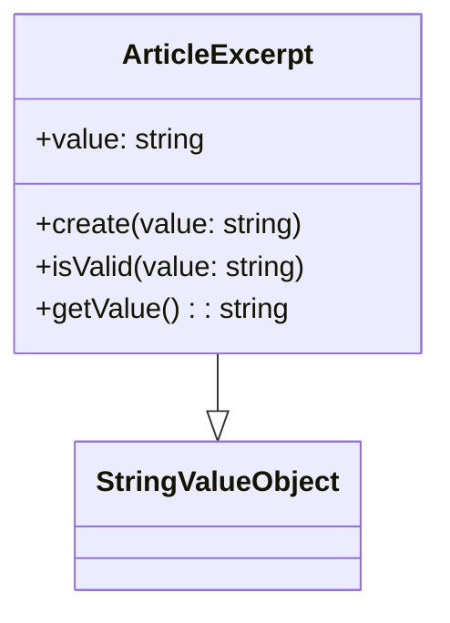
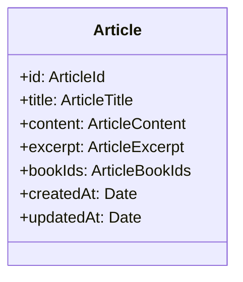

# Plan de Implementación: Agregar Excerpt a Artículos

## 1. Dominio

### 1.1 Value Object ArticleExcerpt


#### Tests
1. `ArticleExcerpt.test.ts`:
   - ✓ debería crear un excerpt válido
   - ✓ debería lanzar error si está vacío
   - ✓ debería lanzar error si excede 300 caracteres
   - ✓ debería eliminar espacios en blanco al inicio y final
   - ✓ debería lanzar error si contiene etiquetas HTML básicas (<p>, <div>, etc)
   - ✓ debería lanzar error si contiene HTML con atributos
   - ✓ debería lanzar error si contiene HTML malformado
   - ✓ debería lanzar error si contiene scripts
   - ✓ debería lanzar error si contiene estilos CSS inline
   - ✓ debería permitir caracteres especiales válidos (emojis, etc)

### 1.2 Modificar Article


#### Tests
1. `Article.test.ts`:
   - ✓ debería crear un artículo con excerpt válido
   - ✓ debería actualizar el excerpt
   - ✓ debería incluir el excerpt en toPrimitives()
   - ✓ debería mantener el excerpt al actualizar otros campos

### 1.3 Eventos de Dominio
Actualizar:
- ArticleCreatedDomainEvent
- ArticleUpdatedDomainEvent

#### Tests
1. `ArticleCreatedDomainEvent.test.ts`:
   - ✓ debería incluir excerpt en el evento
2. `ArticleUpdatedDomainEvent.test.ts`:
   - ✓ debería incluir excerpt en el evento

## 2. Infraestructura

### 2.1 Base de datos
Modificar schema:
```sql
ALTER TABLE articles
ADD COLUMN excerpt TEXT NOT NULL;
```

### 2.2 Repositorio
Actualizar PostgresArticleRepository:
- Modificar queries para incluir excerpt
- Actualizar mappers

#### Tests
1. `PostgresArticleRepository.test.ts`:
   - ✓ debería guardar artículo con excerpt
   - ✓ debería recuperar artículo con excerpt
   - ✓ debería actualizar excerpt

## 3. Aplicación

### 3.1 Casos de Uso
Actualizar:
- CreateArticle
- UpdateArticle
- GetArticle
- ListArticles

#### Tests
1. `CreateArticle.test.ts`:
   - ✓ debería crear artículo con excerpt
   - ✓ debería validar excerpt requerido
   - ✓ debería validar longitud máxima del excerpt
   - ✓ debería validar que no contenga HTML

2. `UpdateArticle.test.ts`:
   - ✓ debería actualizar excerpt
   - ✓ debería mantener excerpt existente si no se proporciona
   - ✓ debería validar nuevo excerpt
   - ✓ debería validar que no contenga HTML al actualizar

3. `GetArticle.test.ts`:
   - ✓ debería incluir excerpt en respuesta

4. `ListArticles.test.ts`:
   - ✓ debería incluir excerpt en listado

## 4. API

### 4.1 Endpoints
Actualizar:
- POST /api/blog/articles
- PUT /api/blog/articles/[id]
- GET /api/blog/articles
- GET /api/blog/articles/[id]

### 4.2 Tests E2E
1. `articles.spec.ts`:
   - ✓ debería crear artículo con excerpt válido
   - ✓ debería rechazar excerpt con HTML
   - ✓ debería rechazar excerpt vacío
   - ✓ debería rechazar excerpt muy largo
   - ✓ debería actualizar excerpt
   - ✓ debería obtener artículo con excerpt
   - ✓ debería listar artículos con excerpt

## 5. Documentación

### 5.1 OpenAPI
Actualizar schemas y ejemplos en:
- openapi-schemas.json
- examples.md

## Orden de Implementación (TDD)

1. Value Object (ArticleExcerpt)
   - Escribir tests para ArticleExcerpt
   - Implementar ArticleExcerpt
   - Verificar tests

2. Dominio (Article)
   - Escribir tests para Article con nuevo campo
   - Modificar Article
   - Verificar tests

3. Eventos
   - Escribir tests para eventos actualizados
   - Modificar eventos
   - Verificar tests

4. Infraestructura
   - Escribir tests para repositorio
   - Actualizar schema y repositorio
   - Verificar tests

5. Casos de Uso
   - Escribir tests para cada caso de uso
   - Implementar cambios
   - Verificar tests

6. API y E2E
   - Escribir tests E2E
   - Implementar cambios en API
   - Verificar tests

7. Documentación
   - Actualizar OpenAPI
   - Verificar ejemplos

## Criterios de Aceptación

1. ✓ Todos los tests pasan (unitarios, integración, E2E)
2. ✓ API documentada y actualizada
3. ✓ Validaciones de HTML implementadas y testeadas
4. ✓ Rendimiento validado en listados grandes
