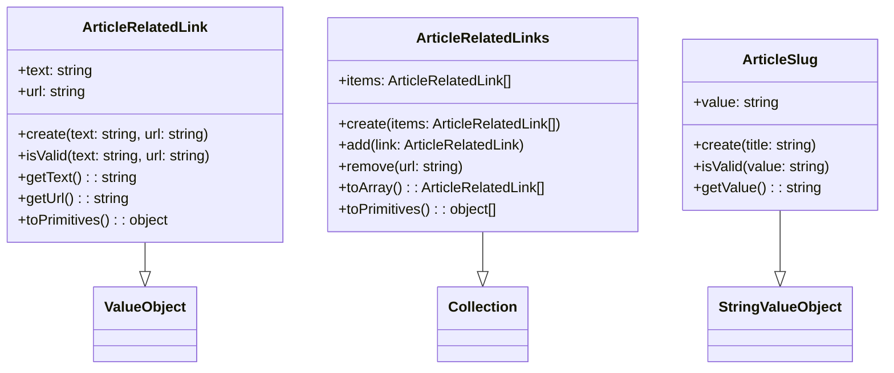
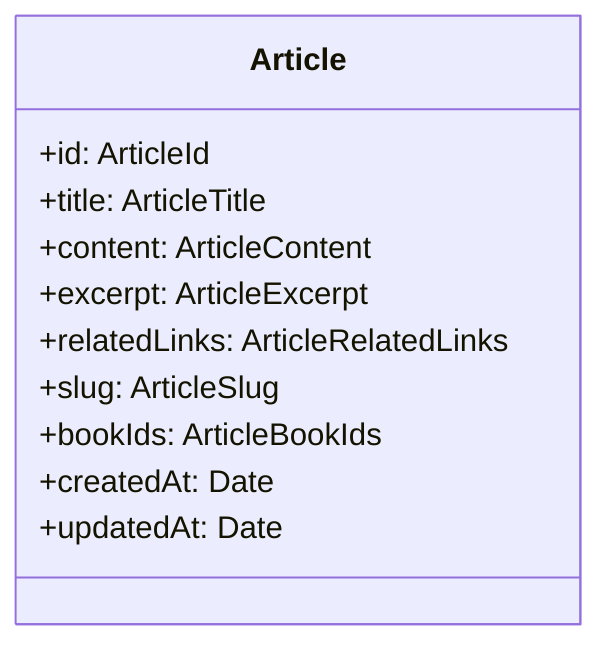

# Plan de Implementación: Agregar Related Links y Slug a Artículos

## 1. Dominio

### 1.1 Value Objects


#### Tests
1. `ArticleRelatedLink.test.ts`:
   - ✓ debería crear un enlace válido
   - ✓ debería lanzar error si el texto está vacío
   - ✓ debería lanzar error si el texto excede 100 caracteres
   - ✓ debería lanzar error si la URL está vacía
   - ✓ debería lanzar error si la URL es inválida
   - ✓ debería lanzar error si la URL excede 2000 caracteres
   - ✓ debería eliminar espacios en blanco

2. `ArticleRelatedLinks.test.ts`:
   - ✓ debería crear una colección válida
   - ✓ debería permitir colección vacía
   - ✓ debería lanzar error si excede 10 enlaces
   - ✓ debería lanzar error si hay URLs duplicadas
   - ✓ debería permitir añadir enlaces
   - ✓ debería permitir eliminar enlaces

3. `ArticleSlug.test.ts`:
   - ✓ debería generar slug válido desde título
   - ✓ debería eliminar acentos
   - ✓ debería convertir a minúsculas
   - ✓ debería reemplazar espacios por guiones
   - ✓ debería eliminar caracteres especiales
   - ✓ debería eliminar guiones consecutivos
   - ✓ debería truncar a 100 caracteres
   - ✓ debería mantener números
   - ✓ debería eliminar guiones inicial/final

### 1.2 Modificar Article


#### Tests
1. `Article.test.ts`:
   - ✓ debería crear artículo con enlaces relacionados
   - ✓ debería crear artículo sin enlaces relacionados
   - ✓ debería generar slug automáticamente del título
   - ✓ debería actualizar slug al cambiar título
   - ✓ debería incluir enlaces y slug en toPrimitives()

### 1.3 Eventos de Dominio
Actualizar:
- ArticleCreatedDomainEvent
- ArticleUpdatedDomainEvent

#### Tests
1. `ArticleCreatedDomainEvent.test.ts`:
   - ✓ debería incluir enlaces relacionados en el evento
   - ✓ debería incluir slug en el evento

2. `ArticleUpdatedDomainEvent.test.ts`:
   - ✓ debería incluir enlaces relacionados en el evento
   - ✓ debería incluir slug en el evento

## 2. Infraestructura

### 2.1 Base de datos
Modificar schema:
```sql
ALTER TABLE articles
ADD COLUMN related_links JSONB DEFAULT '[]'::jsonb NOT NULL,
ADD COLUMN slug VARCHAR(100) NOT NULL,
ADD CONSTRAINT articles_slug_unique UNIQUE (slug);
```

### 2.2 Repositorio
Actualizar PostgresArticleRepository:
- Modificar queries para incluir related_links y slug
- Actualizar mappers
- Implementar control de colisiones de slug

#### Tests
1. `PostgresArticleRepository.test.ts`:
   - ✓ debería guardar artículo con enlaces relacionados
   - ✓ debería guardar artículo con slug
   - ✓ debería recuperar artículo con enlaces y slug
   - ✓ debería actualizar enlaces
   - ✓ debería actualizar slug
   - ✓ debería manejar colisiones de slug
   - ✓ debería buscar por slug

## 3. Aplicación

### 3.1 Casos de Uso
Actualizar:
- CreateArticle
- UpdateArticle
- GetArticle
- ListArticles

#### Tests
1. `CreateArticle.test.ts`:
   - ✓ debería crear artículo con enlaces relacionados
   - ✓ debería crear artículo sin enlaces
   - ✓ debería generar y guardar slug
   - ✓ debería validar enlaces
   - ✓ debería manejar colisiones de slug

2. `UpdateArticle.test.ts`:
   - ✓ debería actualizar enlaces
   - ✓ debería mantener enlaces si no se proporcionan
   - ✓ debería actualizar slug si cambia título
   - ✓ debería validar nuevos enlaces
   - ✓ debería manejar colisiones de slug al actualizar

3. `GetArticle.test.ts`:
   - ✓ debería incluir enlaces en respuesta
   - ✓ debería incluir slug en respuesta
   - ✓ debería permitir buscar por slug

4. `ListArticles.test.ts`:
   - ✓ debería incluir enlaces en listado
   - ✓ debería incluir slug en listado

## 4. API

### 4.1 Endpoints
Actualizar:
- POST /api/blog/articles
- PUT /api/blog/articles/[id]
- GET /api/blog/articles
- GET /api/blog/articles/[id]
- GET /api/blog/articles/by-slug/[slug] (nuevo)

### 4.2 Tests E2E
1. `articles.spec.ts`:
   - ✓ debería crear artículo con enlaces válidos
   - ✓ debería crear artículo sin enlaces
   - ✓ debería rechazar enlaces inválidos
   - ✓ debería rechazar demasiados enlaces
   - ✓ debería rechazar URLs duplicadas
   - ✓ debería generar slug correcto
   - ✓ debería actualizar enlaces
   - ✓ debería actualizar slug al cambiar título
   - ✓ debería obtener artículo con enlaces y slug
   - ✓ debería listar artículos con enlaces y slug
   - ✓ debería encontrar artículo por slug

## 5. Documentación

### 5.1 OpenAPI
Actualizar schemas y ejemplos en:
- openapi-schemas.json
- examples.md

## Orden de Implementación (TDD)

1. Value Objects
   - Escribir tests para ArticleRelatedLink
   - Implementar ArticleRelatedLink
   - Escribir tests para ArticleRelatedLinks
   - Implementar ArticleRelatedLinks
   - Escribir tests para ArticleSlug
   - Implementar ArticleSlug
   - Verificar todos los tests

2. Dominio (Article)
   - Escribir tests para Article con nuevos campos
   - Modificar Article
   - Verificar tests

3. Eventos
   - Escribir tests para eventos actualizados
   - Modificar eventos
   - Verificar tests

4. Infraestructura
   - Escribir tests para repositorio
   - Actualizar schema
   - Implementar cambios en repositorio
   - Verificar tests

5. Casos de Uso
   - Escribir tests para cada caso de uso
   - Implementar cambios
   - Verificar tests

6. API y E2E
   - Escribir tests E2E
   - Implementar cambios en API
   - Implementar nuevo endpoint by-slug
   - Verificar tests

7. Documentación
   - Actualizar OpenAPI
   - Verificar ejemplos

## Criterios de Aceptación

1. ✓ Todos los tests pasan (unitarios, integración, E2E)
2. ✓ API documentada y actualizada
3. ✓ Enlaces relacionados opcionales y validados
4. ✓ Slugs únicos y válidos generados automáticamente
5. ✓ Búsqueda por slug implementada
6. ✓ Manejo correcto de colisiones de slug
7. ✓ Rendimiento validado en listados grandes
