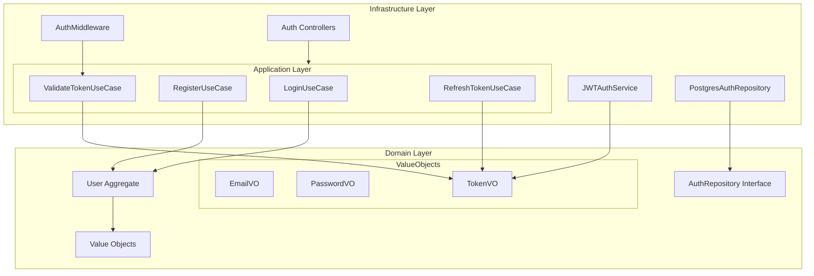

# Plan de Implementación: Sistema de Autenticación

## Estructura del Módulo



## Fases de Implementación

### Fase 1: Domain Layer
1. **Value Objects**
   ```typescript
   - EmailVO (validación de email)
   - PasswordVO (hash y validación de contraseña)
   - TokenVO (validación JWT)
   ```

2. **User Aggregate**
   ```typescript
   - Propiedades: id, email, password
   - Métodos: validatePassword
   - Eventos: UserCreated, UserAuthenticated
   ```

3. **Interfaces**
   ```typescript
   - AuthRepository
   - JWTService
   ```

### Fase 2: Application Layer
1. **Use Cases**
   ```typescript
   - RegisterUseCase
   - LoginUseCase
   - ValidateTokenUseCase
   - RefreshTokenUseCase
   ```

2. **DTOs**
   ```typescript
   - RegisterRequest/Response
   - LoginRequest/Response
   - TokenValidationRequest/Response
   ```

### Fase 3: Infrastructure Layer
1. **Repositories**
   ```typescript
   - PostgresAuthRepository
   - Migrations para tabla users
   ```

2. **Services**
   ```typescript
   - JWTAuthService (implementación con jsonwebtoken)
   ```

3. **Middleware**
   ```typescript
   - AuthMiddleware (validación de token)
   ```

4. **Controllers**
   ```typescript
   - POST /api/backoffice/auth/register
   - POST /api/backoffice/auth/login
   - POST /api/backoffice/auth/refresh-token
   ```

## Plan de Testing

### 1. Unit Tests
```typescript
// Domain
- Value Objects (email, password, token)
- User aggregate
- Use Cases

// Application
- Use case implementations
- DTOs validations
```

### 2. Integration Tests
```typescript
// Infrastructure
- PostgresAuthRepository
- JWTAuthService
- Middleware functionality
```

### 3. E2E Tests
```typescript
// API Endpoints
- Register flow
- Login flow
- Protected routes
- Token refresh flow
```

## Migración Base de Datos

```sql
CREATE TABLE users (
    id UUID PRIMARY KEY,
    email VARCHAR(255) UNIQUE NOT NULL,
    password VARCHAR(255) NOT NULL,
    created_at TIMESTAMP NOT NULL DEFAULT NOW(),
    updated_at TIMESTAMP NOT NULL DEFAULT NOW()
);

CREATE INDEX idx_users_email ON users(email);
```

## Orden de Implementación

1. **Setup Inicial**
   - Crear estructura de carpetas
   - Configurar dependencias (jsonwebtoken, bcrypt)
   - Crear migración de base de datos

2. **Implementación Core**
   - Value Objects
   - User Aggregate
   - Repositories
   - Use Cases

3. **Infraestructura**
   - JWT Service
   - PostgreSQL Repository
   - Middleware

4. **API y Testing**
   - Controllers
   - Tests unitarios
   - Tests de integración
   - Tests E2E

5. **Documentación**
   - Actualizar Swagger
   - Documentar endpoints
   - Ejemplos de uso

## Métricas de Éxito

1. **Funcionalidad**
   - Todos los tests pasan
   - Endpoints funcionan según especificación
   - Middleware protege rutas correctamente

2. **Seguridad**
   - Tokens JWT válidos
   - Passwords hasheados correctamente
   - Protección de rutas funciona

3. **Performance**
   - Tiempo de respuesta < 200ms
   - Uso de memoria estable
   - No memory leaks
