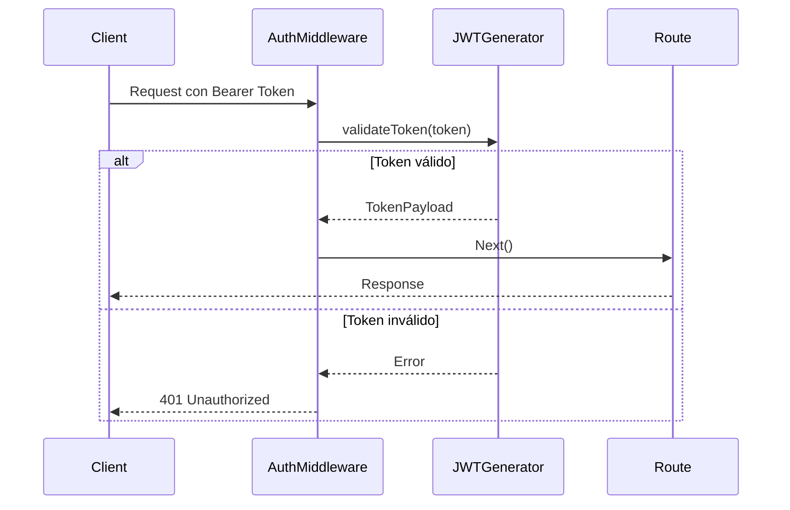

# Plan de Implementación: Auth Middleware

## Objetivo
Implementar un middleware de autenticación que valide tokens JWT para proteger las rutas de la API del backoffice.

## Diseño Técnico



## Estructura del Middleware

```typescript
interface AuthMiddleware {
  execute(request: Request): Promise<Response | void>
}

class JWTAuthMiddleware implements AuthMiddleware {
  constructor(private readonly jwtGenerator: JWTGenerator) {}
  
  async execute(request: Request): Promise<Response | void> {
    // Implementación
  }
}
```

## Test Cases

### Unit Tests
1. **Token Validation**
   - Should return 401 when no token is provided
   - Should return 401 when token is malformed
   - Should return 401 when token is expired
   - Should call next() when token is valid

2. **Token Extraction**
   - Should extract token from Authorization header
   - Should handle missing Authorization header
   - Should handle malformed Authorization header

### Integration Tests
1. **Protected Routes**
   - Should protect /backoffice routes
   - Should allow access with valid token
   - Should reject access with invalid token

### E2E Tests
1. **Complete Flow**
   - Login -> Get Token -> Access Protected Route
   - Invalid Token -> 401 Response
   - No Token -> 401 Response

## Pasos de Implementación (TDD)

1. **Setup Inicial**
   ```typescript
   // Test inicial
   describe('AuthMiddleware', () => {
     it('should return 401 when no token is provided', async () => {
       // Implementación
     })
   })
   ```

2. **Token Extraction**
   - Implementar extracción de token del header
   - Validar formato Bearer
   - Manejar casos de error

3. **Token Validation**
   - Integrar con JWTGenerator
   - Validar token y extraer payload
   - Manejar errores de validación

4. **Request Processing**
   - Añadir payload a request context
   - Implementar next() para tokens válidos
   - Retornar 401 para tokens inválidos

5. **Error Handling**
   - Manejar diferentes tipos de errores
   - Proporcionar mensajes claros
   - Logging apropiado

## Modificaciones Necesarias

### 1. JWTGenerator
```typescript
interface JWTGenerator {
  validateToken(token: string): Promise<TokenPayload>
}
```

### 2. Next.js Route Configuration
```typescript
import { AuthMiddleware } from '@/contexts/shared/infrastructure/middleware/AuthMiddleware'

// Aplicar middleware a rutas protegidas
export const middleware = AuthMiddleware.execute
export const config = {
  matcher: '/api/backoffice/:path*'
}
```

## Plan de Testing

1. **Unit Testing**
   - Implementar mocks para JWTGenerator
   - Probar cada caso de uso independientemente
   - Verificar manejo de errores

2. **Integration Testing**
   - Probar con JWTGenerator real
   - Verificar integración con rutas
   - Validar flujo completo

3. **E2E Testing**
   - Probar flujo completo con API real
   - Validar protección de rutas
   - Verificar respuestas correctas

## Criterios de Éxito

1. **Funcionalidad**
   - Todos los tests pasan
   - Rutas protegidas correctamente
   - Manejo adecuado de errores

2. **Rendimiento**
   - Latencia < 50ms para validación
   - No memory leaks
   - Escalable con múltiples requests

3. **Seguridad**
   - Validación robusta de tokens
   - Sin vulnerabilidades de seguridad
   - Logs apropiados para auditoría

## Timeline Estimado
1. Setup y tests iniciales: 2 horas
2. Implementación core: 3 horas
3. Testing e integración: 2 horas
4. Documentación y revisión: 1 hora

Total: 8 horas de desarrollo
