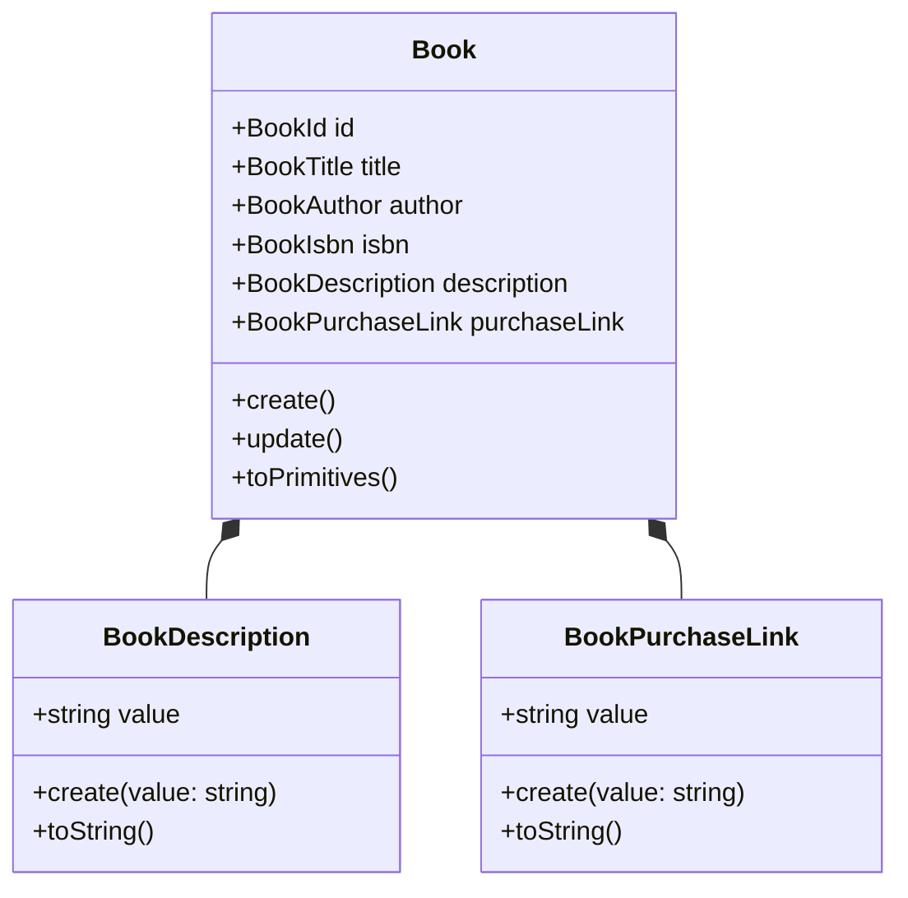
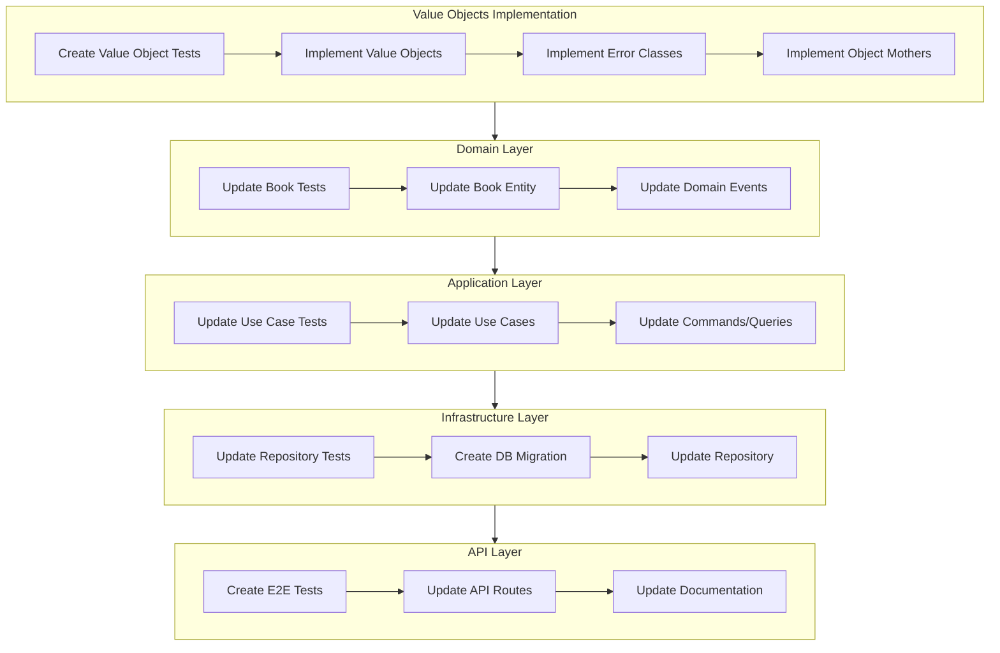
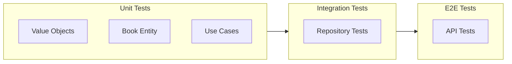
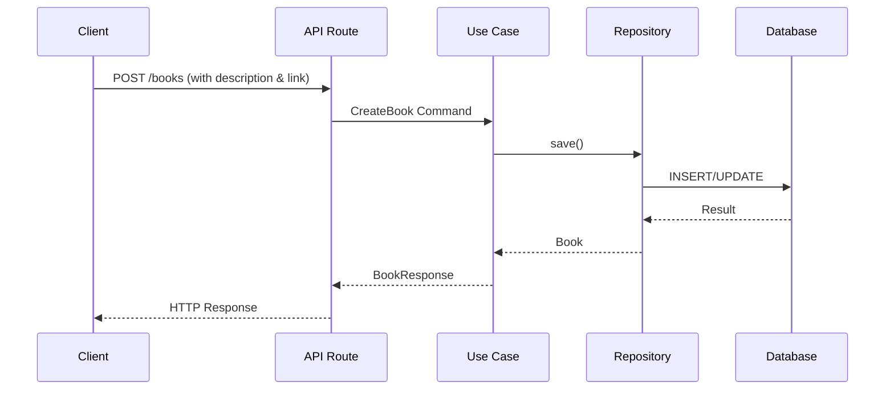

# Diagramas de Implementación: Book Description y Purchase Link

## Estructura de Componentes

## Flujo de Implementación TDD

## Estructura de Tests

## Flujo de Datos

Estos diagramas ilustran:
1. La estructura de los nuevos componentes y sus relaciones
2. El flujo de implementación siguiendo TDD
3. La jerarquía y organización de los tests
4. El flujo de datos a través de las diferentes capas

La implementación seguirá este orden específico, asegurando que cada componente esté probado adecuadamente antes de pasar al siguiente.
