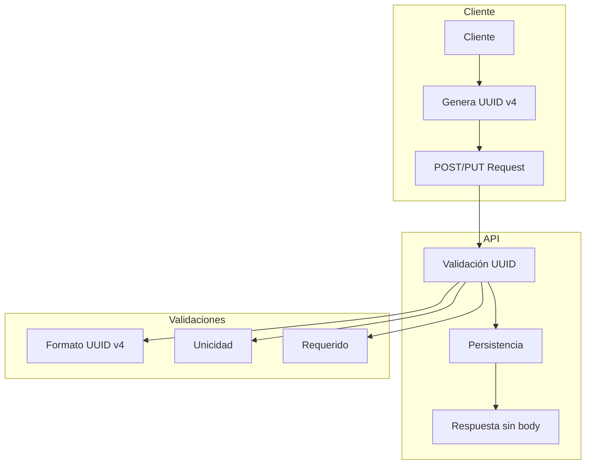

# Client-Side UUID Generation Implementation Plan

## Objetivo
Implementar la generación de UUIDs en el lado del cliente, comenzando por el módulo Book como piloto.

## Diagrama de Cambios


## Pasos de Implementación

### 1. Domain Layer
1. Crear/Modificar Value Objects
   - Actualizar `BookId` para validar formato UUID v4
   - Añadir `BookIdInvalid` error
   - Añadir `BookIdDuplicated` error

2. Actualizar Entidad Book
   - Modificar constructor para recibir ID
   - Actualizar validaciones

### 2. Application Layer
1. Modificar Use Cases
   - Actualizar `CreateBook` para no generar ID
   - Modificar `UpdateBook` para validar ID existente
   - Implementar validación de unicidad

### 3. Infrastructure Layer
1. Repository
   - Actualizar `PostgresBookRepository`
   - Implementar check de duplicados

2. API Routes
   - Modificar respuestas (201/204 sin body)
   - Implementar validación de formato UUID
   - Actualizar manejo de errores

## Plan de Testing

### 1. Unit Tests
- Value Objects
  ```typescript
  describe('BookId', () => {
    test('should accept valid UUID v4')
    test('should reject invalid UUID format')
    test('should reject empty UUID')
  })
  ```

- Domain Entity
  ```typescript
  describe('Book', () => {
    test('should create with client provided UUID')
    test('should reject invalid UUID')
  })
  ```

### 2. Integration Tests
- Repository
  ```typescript
  describe('PostgresBookRepository', () => {
    test('should store book with client UUID')
    test('should reject duplicate UUID')
  })
  ```

### 3. E2E Tests
- API Endpoints
  ```typescript
  describe('POST /api/blog/books', () => {
    test('should create with valid UUID')
    test('should return 201 without body')
    test('should reject invalid UUID')
    test('should reject duplicate UUID')
  })

  describe('PUT /api/blog/books/:id', () => {
    test('should update and return 204')
    test('should reject invalid UUID')
  })
  ```

## Migración y Despliegue

### 1. Base de Datos
- No se requieren cambios en el esquema

### 2. API
1. Validaciones Adicionales
   - Formato UUID v4
   - Verificación de duplicados

2. Modificación de Respuestas
   - 201 Created sin body
   - 204 No Content sin body
   - 409 Conflict para duplicados
   - 400 Bad Request para formato inválido

## Documentación a Actualizar

1. API Documentation
   - Nuevos formatos de request/response
   - Ejemplos de UUID v4
   - Códigos de error

2. Swagger/OpenAPI
   - Actualizar schemas
   - Actualizar ejemplos
   - Documentar nuevos errores

## Rollback Plan

1. Mantener generación de IDs en servidor como fallback
2. Monitorear errores de validación UUID
3. Plan de reversión si se detectan problemas

## Siguientes Pasos

1. Evaluar implementación en Book module
2. Recopilar métricas y feedback
3. Planear extensión a otros módulos
