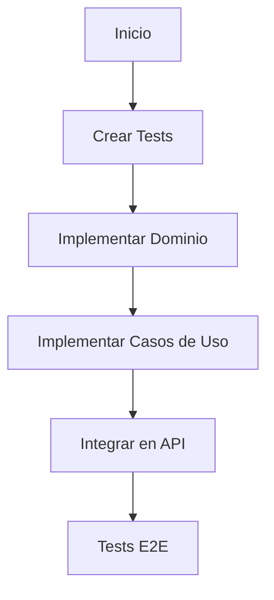

# Plan de Implementación: Integridad Referencial Libros-Artículos

## 1. Configuración Inicial (TDD Setup)



### 1.1 Estructura de Tests

```
src/contexts/backoffice/article/domain/__tests__/
  ├── ArticleBookIds.test.ts
  └── mothers/
      └── ArticleBookIdsMother.ts

src/contexts/backoffice/book/application/__tests__/
  └── DeleteBook.test.ts

tests/e2e/
  └── book-article-integrity.test.ts
```

## 2. Plan de Desarrollo TDD

### Fase 1: Domain Layer

1. **ArticleBookIds Value Object**
   ```typescript
   describe('ArticleBookIds', () => {
     describe('validation', () => {
       it('should throw InvalidBookReferenceError when book does not exist')
       it('should accept valid book references')
       it('should handle empty book references')
       it('should prevent duplicate book references')
     })
   })
   ```

2. **Implement Domain Events**
   ```typescript
   // BookDeletedDomainEvent.ts
   class BookDeletedDomainEvent extends DomainEvent {
     constructor(
       readonly aggregateId: string,
       readonly occurredOn: Date
     ) {}
   }
   ```

### Fase 2: Application Layer

1. **Modify DeleteBook Use Case**
   ```typescript
   describe('DeleteBook', () => {
     it('should emit BookDeletedDomainEvent')
     it('should coordinate article updates')
     it('should maintain transaction atomicity')
   })
   ```

2. **ArticleRepository Interface**
   ```typescript
   interface ArticleRepository {
     removeBookReference(bookId: string): Promise<void>
     findByBookId(bookId: string): Promise<Article[]>
   }
   ```

### Fase 3: Infrastructure Layer

1. **PostgresArticleRepository Implementation**
   ```typescript
   describe('PostgresArticleRepository', () => {
     describe('removeBookReference', () => {
       it('should remove book reference from articles')
       it('should handle non-existing references')
     })
   })
   ```

2. **Transaction Management**
   ```sql
   -- SQL Transaction Example
   BEGIN;
   DELETE FROM books WHERE id = $1;
   UPDATE articles SET book_ids = array_remove(book_ids, $1);
   COMMIT;
   ```

### Fase 4: API Integration

1. **Update Book DELETE Endpoint**
   ```typescript
   describe('/api/books/:id DELETE', () => {
     it('should remove book and update articles')
     it('should return 404 for non-existing book')
     it('should handle concurrent requests')
   })
   ```

## 3. Tests E2E

```typescript
describe('Book-Article Integrity', () => {
  describe('when deleting a book', () => {
    it('should remove book reference from all articles')
    it('should maintain other article data intact')
  })

  describe('when creating an article', () => {
    it('should validate book references exist')
    it('should reject invalid book references')
  })
})
```

## 4. Plan de Ejecución

### Sprint 1: Dominio y Tests Base
1. ✅ Escribir tests para ArticleBookIds
2. ✅ Implementar validación de libros en ArticleBookIds
3. ✅ Crear BookDeletedDomainEvent
4. ✅ Implementar tests base para DeleteBook

### Sprint 2: Casos de Uso y Repositorio
1. ✅ Modificar DeleteBook use case
2. ✅ Implementar nuevo método en ArticleRepository
3. ✅ Actualizar PostgresArticleRepository
4. ✅ Implementar manejo de transacciones

### Sprint 3: API y Tests E2E
1. ✅ Actualizar endpoint DELETE /api/books/:id
2. ✅ Implementar tests E2E
3. ✅ Validar integridad en endpoints de artículos
4. ✅ Documentar cambios en OpenAPI

## 5. Validación y Monitoreo

### Métricas de Éxito
- 100% cobertura en nuevos tests
- 0 referencias huérfanas en producción
- Tiempo de respuesta < 200ms en operaciones de borrado

### Monitoreo
- Logs de operaciones de borrado
- Métricas de integridad referencial
- Alertas en caso de inconsistencias

## 6. Rollback Plan

### En caso de problemas
1. Revertir cambios en endpoint DELETE
2. Mantener referencias existentes
3. Documentar inconsistencias encontradas
4. Planificar migración de datos si es necesario
