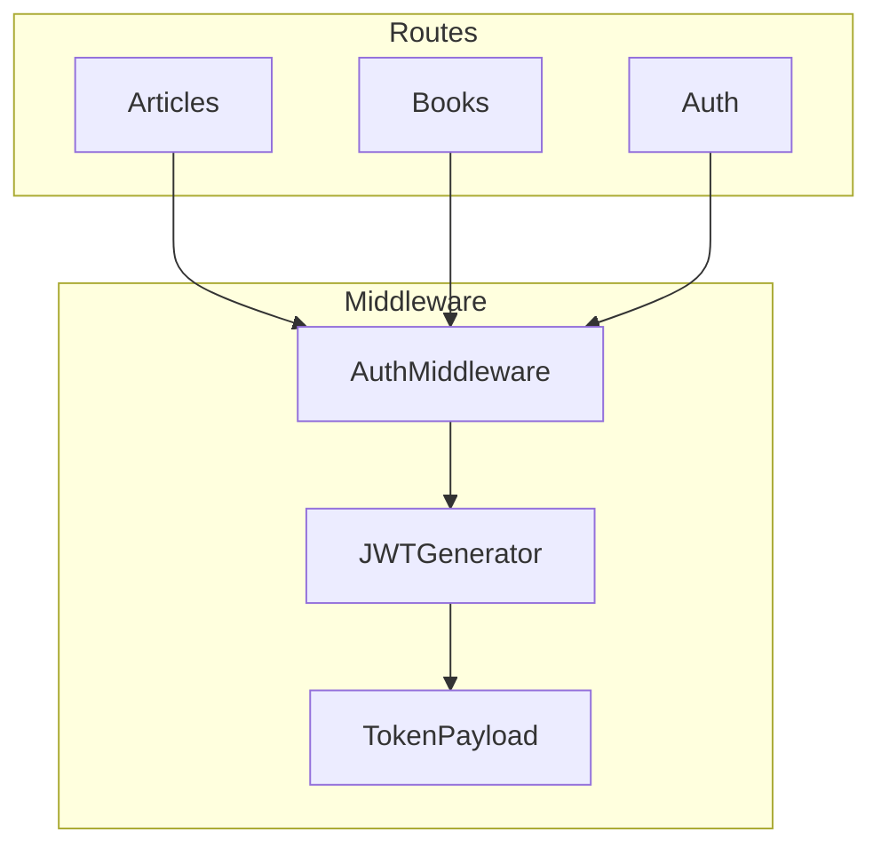

# Active Context: Implementación de Autenticación JWT

## Estado Actual del Proyecto
- El módulo de autenticación base está implementado (login, registro, JWT)
- Las rutas de la API están documentadas para requerir autenticación
- Falta implementar el middleware de autenticación para proteger las rutas

## Trabajo en Curso

### Implementación de Auth Middleware
Estamos trabajando en la implementación del middleware de autenticación JWT para proteger las rutas del backoffice.

#### Documentación Relacionada
- [ADR-013: Autenticación JWT](../adr/013-autenticacion-jwt.md)
- [OBR-003: Reglas de Autenticación](../obr/003-auth-rules.md)
- [Plan de Implementación: Auth Middleware](../implementation-plans/auth-middleware.md)

#### Componentes Principales

#### Estado de la Implementación
1. **Completado ✅**
   - Módulo de autenticación base
   - Documentación de requisitos
   - Plan de implementación del middleware

2. **En Progreso 🚧**
   - Implementación del middleware usando TDD
   - Tests unitarios del middleware
   - Integración con rutas existentes

3. **Pendiente 📋**
   - Tests de integración
   - Tests E2E
   - Actualización de la documentación OpenAPI

## Decisiones Técnicas Activas
1. El middleware será implementado como un middleware de Next.js
2. Se aplicará a todas las rutas bajo /api/backoffice/*
3. Utilizará el JWTGenerator existente para la validación de tokens
4. Seguirá un enfoque TDD estricto

## Próximos Pasos
1. Implementar tests unitarios del middleware
2. Desarrollar la implementación del middleware
3. Integrar con las rutas existentes
4. Ejecutar y validar tests E2E
5. Actualizar la documentación

## Métricas de Éxito
- 100% de cobertura en tests unitarios
- Tests E2E pasando
- Tiempo de respuesta < 50ms para validación de token
- Todas las rutas del backoffice protegidas correctamente

## Riesgos y Mitigaciones
1. **Riesgo**: Impacto en el rendimiento de la API
   - **Mitigación**: Optimizar validación de tokens, considerar caché

2. **Riesgo**: Complejidad en la integración con rutas existentes
   - **Mitigación**: Diseño modular y tests exhaustivos

3. **Riesgo**: Seguridad del sistema de tokens
   - **Mitigación**: Seguir mejores prácticas de JWT, validación robusta
