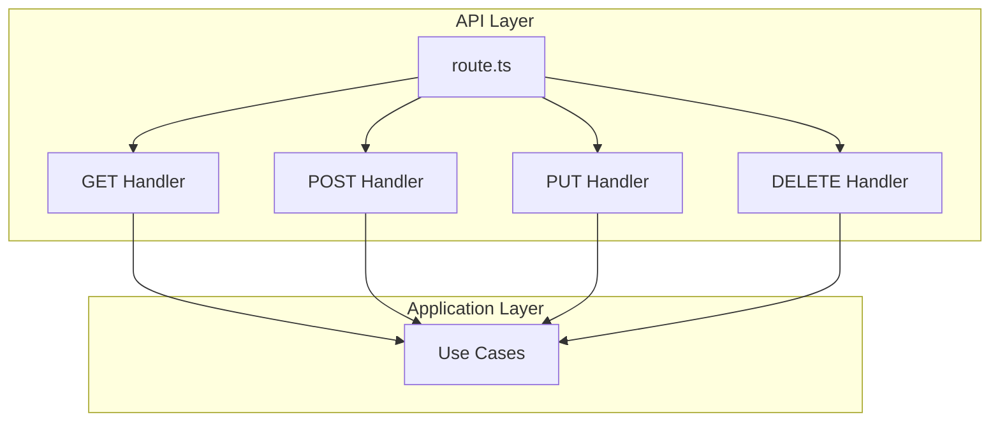
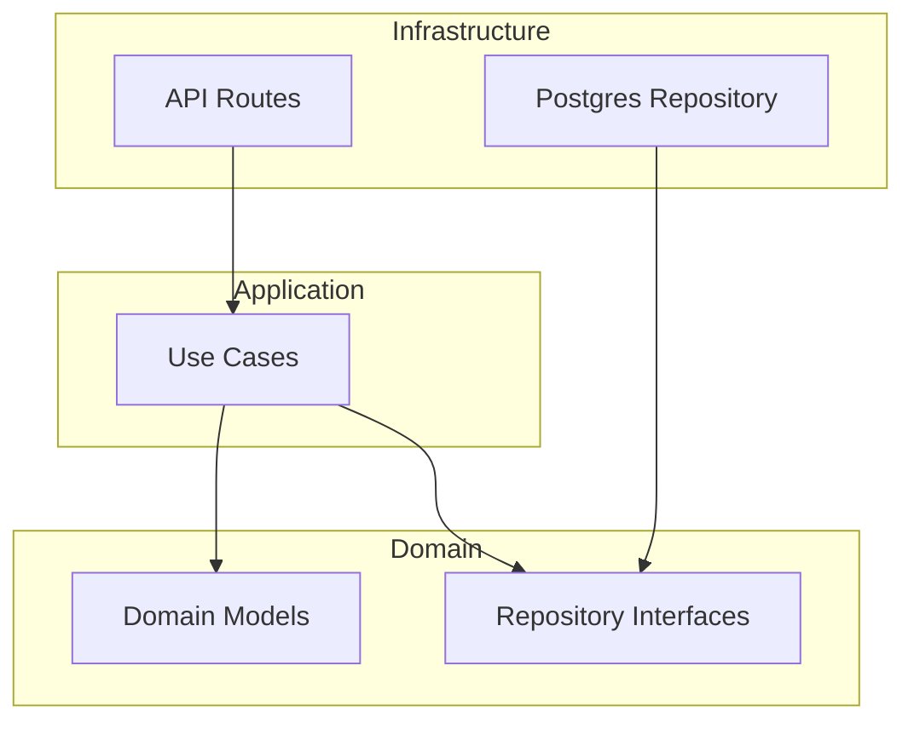
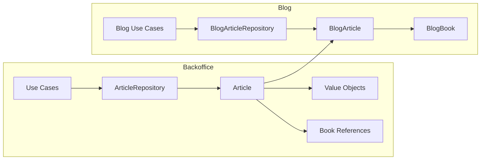
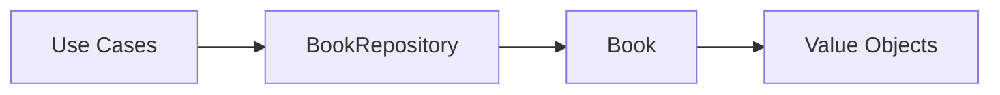
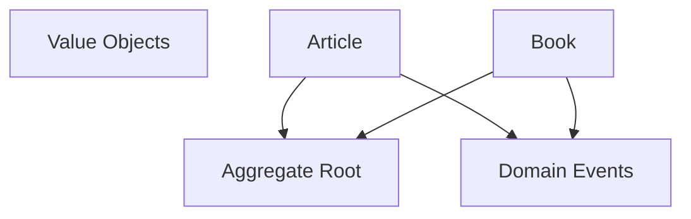

# System Patterns

## System Architecture

### API Controllers Structure (Next.js)

Los controladores API se mantienen en un único archivo route.ts por:
- Mejor cohesión de endpoints relacionados
- Facilita compartir configuración (ej: conexiones DB)
- Controladores delgados que solo orquestan casos de uso
- Sigue el principio "Common Closure Principle"

### Arquitectura Hexagonal (Ports & Adapters)

1. **Domain Layer**
   - Modelos de dominio (Article, Book)
   - Interfaces de repositorio
   - Value Objects
   - Domain Events
   - Reglas de negocio

2. **Application Layer**
   - Casos de uso (Create, Update, Delete, List)
   - Orquestación de entidades
   - Validaciones de aplicación

3. **Infrastructure Layer**
   - Implementaciones de repositorio
   - Controladores API
   - Configuración de base de datos

## Key Technical Decisions

### 1. Value Objects
- Encapsulación de reglas de validación
- Inmutabilidad
- Auto-validación
Ejemplos: ArticleTitle, BookIsbn, ArticleContent

### 2. Repository Pattern
- Abstracción de persistencia
- Interfaces en dominio
- Implementaciones en infraestructura
- Soporte para testing

### 3. Object Mother Pattern
- Creación de objetos para testing
- Generadores de datos válidos/inválidos
- Reutilización en tests

### 4. Domain Events
- Eventos para cambios importantes
- ArticleCreatedDomainEvent
- BookUpdatedDomainEvent

## Design Patterns in Use

### Creational Patterns
- Factory Method (en Value Objects)
- Object Mother (testing)

### Structural Patterns
- Adapter (en repositorios)
- Composite (en Value Objects)

### Behavioral Patterns
- Observer (Domain Events)
- Command (Use Cases)

## Component Relationships

### Articles Context

### Books Context

### Shared Context

## Testing Strategy

1. **Unit Tests**
   - Domain Models
   - Value Objects
   - Use Cases

2. **Integration Tests**
   - Repositories
   - Database Operations

3. **E2E Tests**
   - API Endpoints
   - Full Flow Testing
