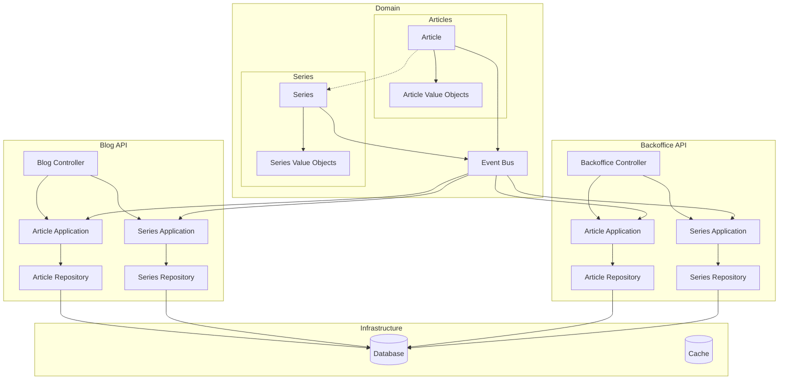
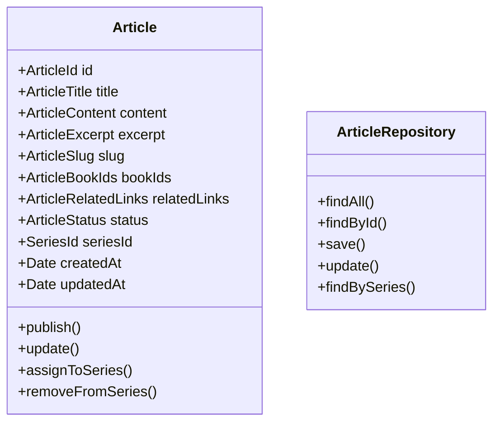
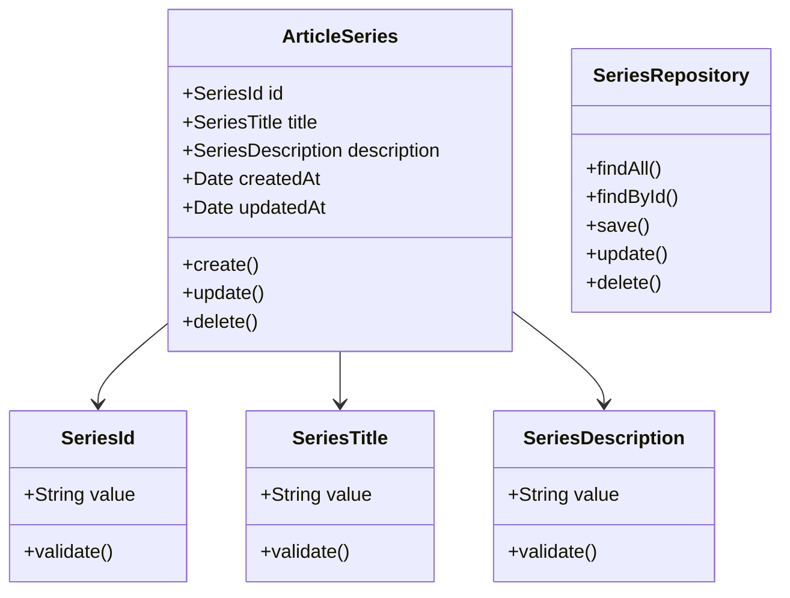
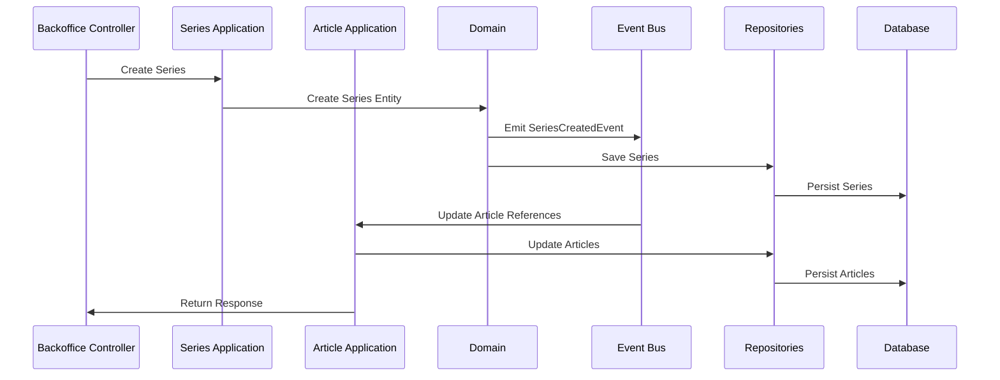

# System Patterns

## Architecture

- Hexagonal Architecture
- DDD (Domain-Driven Design)
- CQRS pattern for queries and commands
- Event-Driven Architecture

## Domain Models

### Articles Domain

### Series Domain

## Event Flow

## Design Patterns

- Repository Pattern para cada dominio
- Factory Pattern para creación de objetos
- Command Pattern para operaciones
- Event-Driven para comunicación entre dominios
- Strategy Pattern para ordenación de artículos
- Observer Pattern para reacciones a eventos
- Decorator Pattern para enriquecer respuestas

## Testing Strategy

- Unit Tests por dominio:
  - Lógica de dominio
  - Value Objects
  - Servicios de aplicación
  - Validaciones
- Integration Tests:
  - Repositorios por dominio
  - Comunicación entre dominios
  - Eventos de dominio
- E2E Tests:
  - Endpoints API
  - Flujos completos

## API Design

- Principios REST
- Separación de endpoints por dominio
- Uso consistente de métodos HTTP
- Formatos de respuesta uniformes
- Manejo de errores por dominio
- Documentación OpenAPI/Swagger

## Database Patterns

- Tablas separadas por dominio
- Claves foráneas para referencias
- Índices optimizados por dominio
- Soft deletes donde aplique
- Timestamps para auditoría
- Constraints específicos por dominio

## Security Patterns

- Autenticación requerida para operaciones de backoffice
- Autorización basada en roles
- Validación de entrada por dominio
- Sanitización de datos
- Protección contra CSRF
- Rate Limiting por endpoints

## Performance Patterns

- Caching por dominio
- Lazy loading de relaciones
- Optimización de queries
- Paginación de resultados
- Índices específicos por dominio
