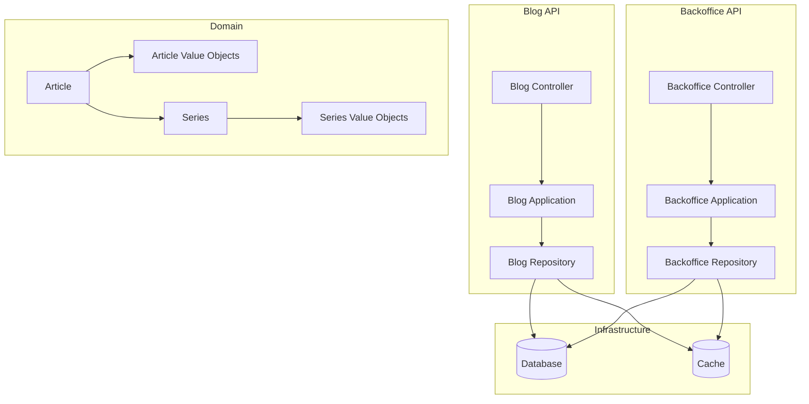
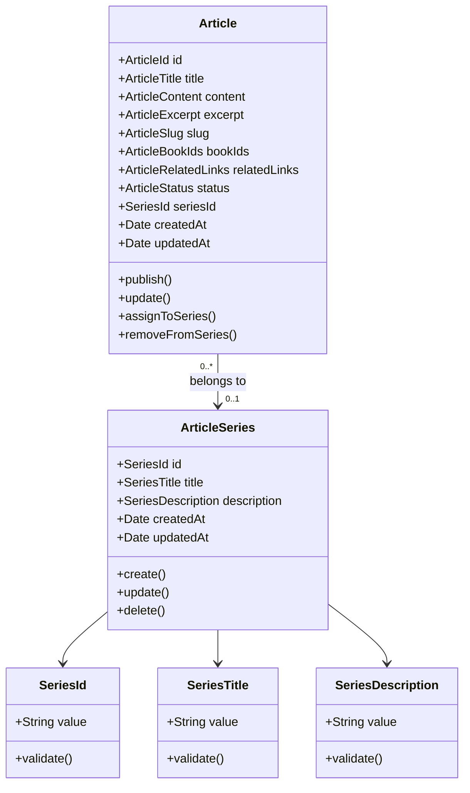
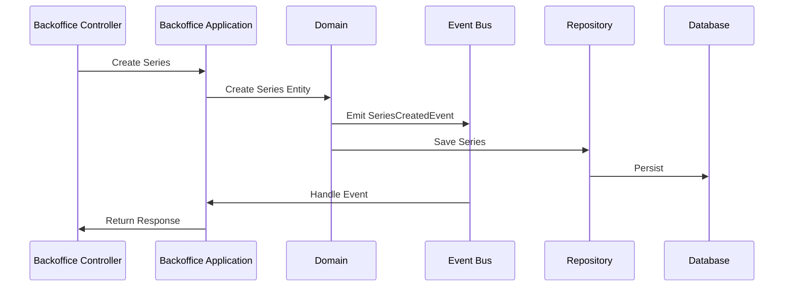

# System Patterns

## Architecture

- Hexagonal Architecture
- DDD (Domain-Driven Design)
- CQRS pattern for queries and commands
- Event-Driven Architecture

## Domain Models

## Event Flow

## Design Patterns

- Repository Pattern para acceso a datos
- Factory Pattern para creación de objetos
- Command Pattern para operaciones
- Event-Driven para eventos de dominio
- Strategy Pattern para ordenación de artículos en series
- Observer Pattern para reaccionar a cambios en series
- Decorator Pattern para enriquecer artículos con info de series

## Testing Strategy

- Unit Tests:
  - Lógica de dominio de Series
  - Value Objects de Series
  - Servicios de aplicación
  - Validaciones de negocio
- Integration Tests:
  - Repositorios
  - Eventos de dominio
  - Flujos completos de operaciones
- E2E Tests:
  - Endpoints API
  - Flujos de usuario completos
- Enfoque TDD para todas las nuevas características

## API Design

- Principios REST
- URLs basadas en recursos
- Uso consistente de métodos HTTP
- Formatos de respuesta uniformes
- Manejo adecuado de errores
- Versionado de API cuando sea necesario
- Documentación OpenAPI/Swagger
- Rate Limiting según necesidad

## Database Patterns

- Uso de claves foráneas para integridad referencial
- Índices para optimización de consultas
- Soft deletes para preservar historial
- Timestamps para auditoría
- Constraints de unicidad
- Índices compuestos según patrones de consulta
- Optimización de queries N+1

## Validations

- Validación a nivel de dominio
- Validación de unicidad en base de datos
- Validación de integridad referencial
- Manejo de errores consistente
- Validaciones específicas de series:
  - Unicidad de título
  - Longitud máxima de descripción
  - Referencias válidas de artículos
  - Reglas de negocio de series

## Security Patterns

- Autenticación requerida para operaciones de backoffice
- Autorización basada en roles
- Validación de entrada
- Sanitización de datos
- Protección contra CSRF
- Rate Limiting
- Logging de operaciones sensibles

## Performance Patterns

- Caching de series y artículos
- Lazy loading de relaciones
- Optimización de queries
- Paginación de resultados
- Índices específicos para búsquedas comunes
