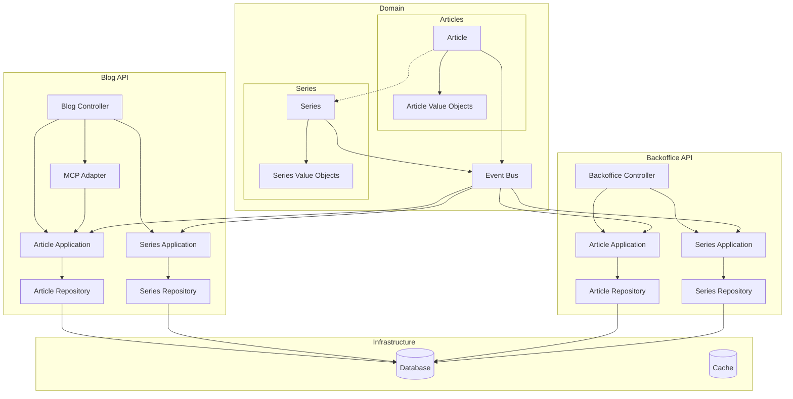
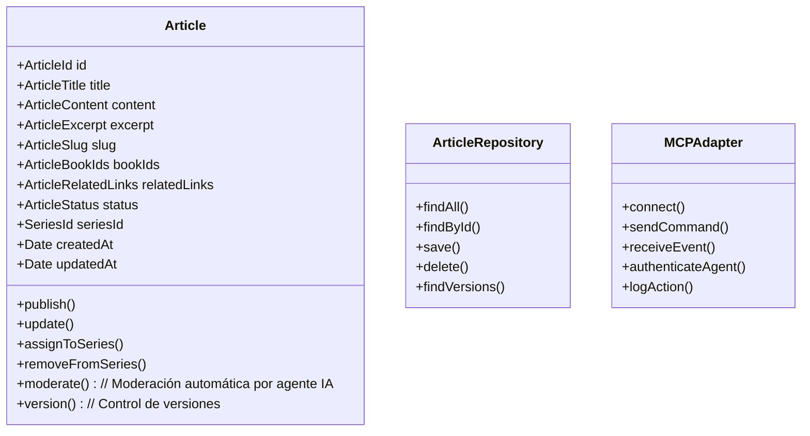

# System Patterns

## Architecture

- Hexagonal Architecture
- DDD (Domain-Driven Design)
- CQRS pattern for queries and commands
- Event-Driven Architecture
- Integración MCP: Adaptador MCP en infraestructura para comunicación con agente IA, middleware de autenticación y control de acceso, logging y auditoría de acciones automáticas.

```mermaid
graph TD
    subgraph Blog API
        BC[Blog Controller]
        BAC[Article Application]
        BSC[Series Application]
        BAR[Article Repository]
        BSR[Series Repository]
        MCP[MCP Adapter]
    end

    subgraph Backoffice API
        BOC[Backoffice Controller]
        BOAC[Article Application]
        BOSC[Series Application]
        BOAR[Article Repository]
        BOSR[Series Repository]
    end

    subgraph Domain
        subgraph Articles
            A[Article]
            VOA[Article Value Objects]
        end

        subgraph Series
            S[Series]
            VOS[Series Value Objects]
        end

        EB[Event Bus]
    end

    subgraph Infrastructure
        DB[(Database)]
        Cache[(Cache)]
    end

    A --> VOA
    S --> VOS
    A -.-> S

    BC --> BAC
    BC --> BSC
    BAC --> BAR
    BSC --> BSR
    BC --> MCP
    MCP --> BAC

    BOC --> BOAC
    BOC --> BOSC
    BOAC --> BOAR
    BOSC --> BOSR

    BAR --> DB
    BSR --> DB
    BOAR --> DB
    BOSR --> DB

    A --> EB
    S --> EB
    EB --> BAC
    EB --> BSC
    EB --> BOAC
    EB --> BOSC
```

## Domain Models

### Articles Domain

```mermaid
classDiagram
    class Article {
        +ArticleId id
        +ArticleTitle title
        +ArticleContent content
        +ArticleExcerpt excerpt
        +ArticleSlug slug
        +ArticleBookIds bookIds
        +ArticleRelatedLinks relatedLinks
        +ArticleStatus status
        +SeriesId seriesId
        +Date createdAt
        +Date updatedAt
        +publish()
        +update()
        +assignToSeries()
        +removeFromSeries()
        +moderate() // Moderación automática por agente IA
        +version()  // Control de versiones
    }

    class ArticleRepository {
        +findAll()
        +findById()
        +save()
        +delete()
        +findVersions()
    }

    class MCPAdapter {
        +connect()
        +sendCommand()
        +receiveEvent()
        +authenticateAgent()
        +logAction()
    }
```
